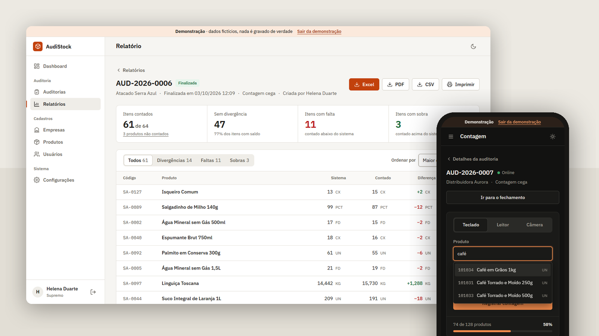
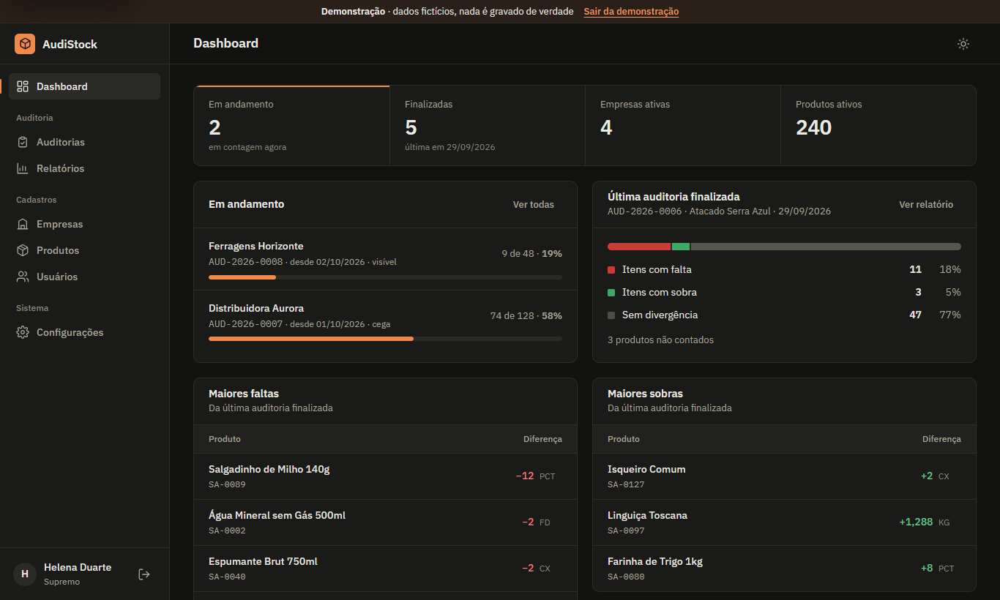
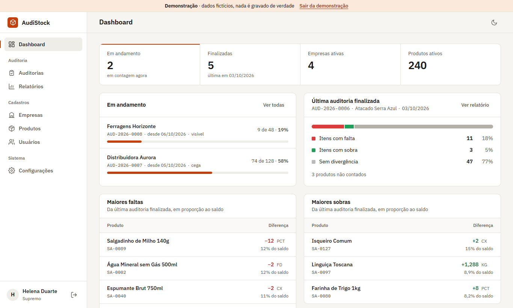
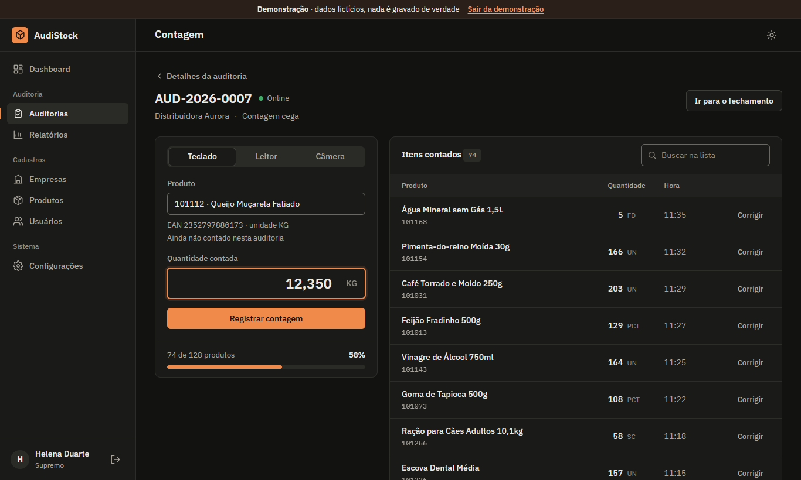
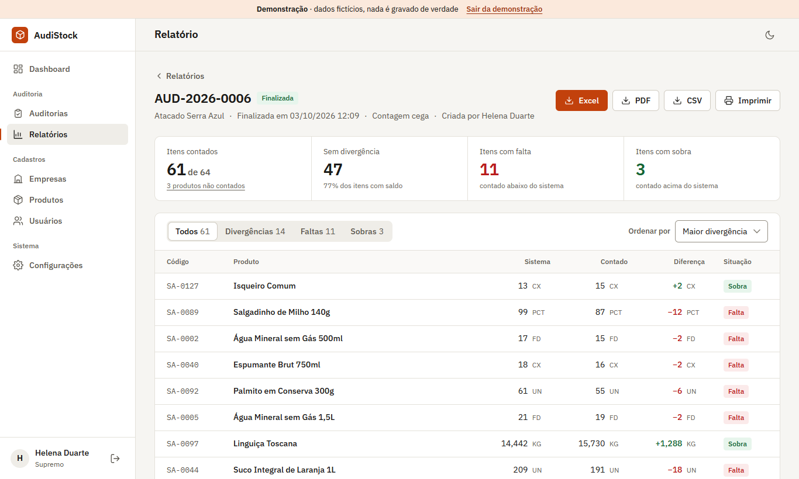
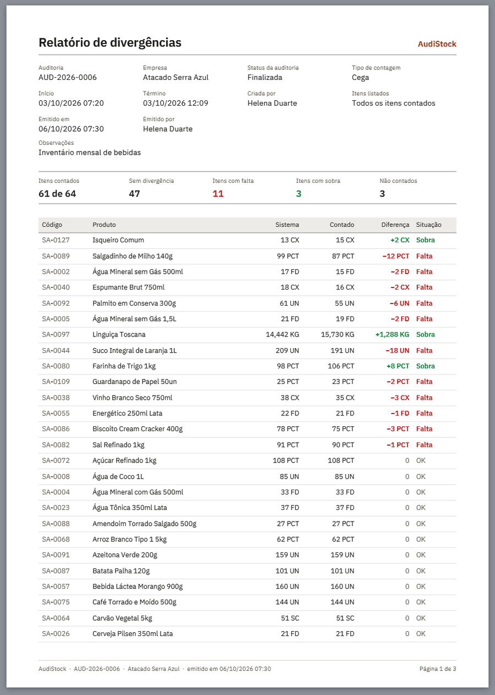
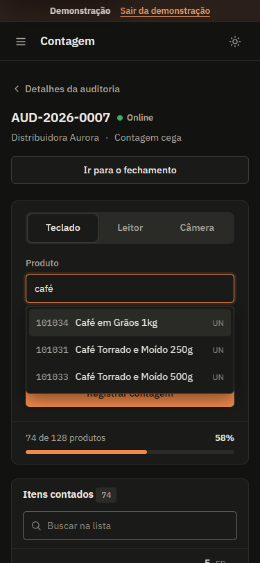

# AudiStock



AudiStock runs physical inventory audits. The team counts what is on the
shelf from a phone, with a barcode scanner or by typing; at closing, they
enter the balance the ERP system shows, and AudiStock lists, item by item,
what is over and what is short. The report comes out as a PDF, an Excel
workbook, a CSV file or a printed sheet.

Plain JavaScript, no framework and no build step, backed by Supabase
(PostgreSQL and authentication). The interface is in Brazilian Portuguese.

**[Open AudiStock](https://alyssom-fernandes.github.io/AudiStock/)** · **[Try the demo](https://alyssom-fernandes.github.io/AudiStock/app.html?demo=1)**,
with fictional companies, products and audits, where nothing is saved.


This README is also available in [Portuguese](README.pt-BR.md).

## In 30 seconds

1. Open the [demo](https://alyssom-fernandes.github.io/AudiStock/app.html?demo=1).
2. In **Auditorias**, open Distribuidora Aurora's count in progress: type
   "arroz", pick the product, enter the quantity and press Enter.
3. In **Relatórios**, open Atacado Serra Azul's report, filter the
   shortages ("Faltas") and download the spreadsheet or the PDF.

## Screens

Captured from the demo mode.

| Dashboard, dark theme | Dashboard, light theme |
|---|---|
|  |  |
| **Counting** | **Discrepancy report** |
|  |  |

| PDF report | On a phone |
|---|---|
|  |  |

## What it does

### Counting

- One audit per company at a time, with a yearly sequential number
  (AUD-2026-0007), a counting type and notes. In a **blind** count the
  counter sees no balance at all; in a **visible** one, they see each
  product's last system balance, taken from the previous finished audit.
- Three ways to record a count: **keyboard**, searching by code, name or
  barcode with arrow-key suggestions; a USB or Bluetooth **scanner**, where
  each scan adds one unit and the field is ready for the next one; and the
  phone **camera**, where the browser supports barcode detection.
- Product already counted: the app asks whether to add or replace, and
  shows the result of each option. Adding is the default, because the same
  product is often stored in more than one place.
- Corrections are kept in the audit history with the previous value, who
  changed it, when and why.
- Offline, counts are stored on the device (IndexedDB). While the
  counting or closing page is open, they are sent as soon as there is a
  connection: when the page opens, when the network comes back and every
  30 seconds. An audit cannot be finished with counts still on the device.

### Closing and report

- At closing, the system balance is typed next to the counted quantity,
  with the difference computed on the spot. Only then is the audit
  finished, with a warning if any balance was left blank. Audits can also
  be cancelled, with the reason recorded.
- The report shows counted items, items without discrepancy, shortages,
  overages, items without a system balance and the products nobody
  counted. For an audit in progress or cancelled, it shows only the count:
  without system balances there is no discrepancy to compute.
- Filters for discrepancies, shortages or overages, sorted by the largest
  discrepancy (by size, shortage or overage), by name or by code.
- Every quantity carries its unit. Fractional units (kg, L, m) always use
  three decimals, so "1,288 kg" is never read as one thousand.
- **Excel** with real numbers (not text), difference and status computed
  by formula, filters, a frozen header, dates in local time and a sheet
  with uncounted products.
- **PDF** to file and sign: audit details, summary, a table with shortages
  and overages highlighted, uncounted products, "Page X of Y" and
  signature lines, which never end up alone on a page.
- **CSV** that opens correctly in Brazilian Excel: semicolons, decimal
  comma, proper accents and the audit and company on every row.
- **Printing** with its own A4 layout, always in the light theme, matching
  the PDF.

### Records and access

- Companies, products and users. Products are imported from an `.xlsx`
  sheet, with a preview of problem rows before importing and a template to
  download, or copied from another company's catalog.
- Four roles: **supremo** (everything, including deleting audits),
  **administrador** (records, creating and cancelling audits),
  **auditor** (records counts and does the closing) and **visualizador**
  (read only). Everyone changes their own password under Configurações.

### Interface

- Light and dark themes, following the device until someone picks one.
- On phones, tables become cards and forms open as bottom sheets.
- Keyboard friendly: dialogs trap focus and close with Esc; in dangerous
  actions, focus starts on "Cancelar".
- Unhandled errors are logged in the browser and listed under
  **Configurações**, with a shortcut in the error notice. In the console,
  `errosRegistrados()` lists the 30 most recent in this browser, from
  every page.

## Demo mode

`?demo=1` on any page (or the **Explorar a demonstração** button on the
login page) swaps Supabase for `js/demo.js`, a fake database that mimics
the part of `supabase-js` the app uses: filters, joins, the two report
views and audit numbering. It holds 5 companies, 263 products, 8 audits in
every status and 8 fictional users, always the same. Data lives only in
the open tab; **Configurações › Restaurar dados da demonstração** starts
over, and `?demo=vazio` opens an empty database. A call the fake database
does not know is logged to `errosRegistrados()` instead of failing
silently.

## How it is built

| Part | Technology |
|---|---|
| Interface | HTML, CSS and JavaScript ES modules, no framework, no build |
| Data and login | Supabase (PostgreSQL, Auth) |
| Offline counting | IndexedDB |
| PDF | jsPDF and jsPDF-AutoTable |
| Excel | ExcelJS to write, SheetJS to read the product sheet |
| Fonts | IBM Plex Sans and IBM Plex Mono (Google Fonts) |

The PDF and spreadsheet libraries are only downloaded when someone exports
or imports.

## Known limitations

- Two people can count the same audit at once, but each one only sees the
  other's records after reloading: there are no real-time updates.
- Camera scanning depends on `BarcodeDetector`, available in Chrome and
  Edge on Android, macOS and ChromeOS. On Windows and iPhone, use a scanner
  or the keyboard.
- Creating a user calls `signUp` in the administrator's browser. With email
  confirmation turned off in Supabase, the session may switch to the newly
  created user. The proper fix is an Edge Function using the service key.
- The database schema (tables, the `vw_relatorio_divergencias` and
  `vw_produtos_nao_auditados` views and the `gerar_numero_auditoria`
  function) is not in this repository.
- The page number and footer on the printed sheet use `@page` margin
  boxes, supported by Chrome and Edge; Firefox prints without that footer.
  The PDF does not depend on it.
- The PDF uses jsPDF's Helvetica, not the IBM Plex used on screen.
- The Relatórios list shows the 200 most recent finished audits; filter by
  company to reach older ones.
- The interface is Portuguese only.

## Running your own copy

1. Create a [Supabase](https://supabase.com) project with the tables, views
   and function listed above, plus access policies (RLS) for authenticated
   users.
2. In `js/supabaseClient.js`, replace the URL and public key with your
   project's (Supabase › Project Settings › API).
3. Create the first user under Authentication › Users and insert their
   profile into the `usuarios` table with the `supremo` role.
4. Serve the files over HTTP (ES modules do not load from `file://`):

```bash
npx serve .
```

To just see it working, none of this is needed: open `app.html?demo=1`.

## Structure

```
index.html              redirects to the login or the app
login.html              sign-in, with the demo entry point
app.html                app shell; screens live in js/telas/
contagem.html           counting (?id=)
estoque-sistema.html    closing: system balances (?id=)
relatorios.html         discrepancy report (?id=)
404.html                not-found page
css/style.css           all styling, both themes and the print sheet
js/
  app.js                router for app.html
  telas/                one screen per file (dashboard, audits, counting…)
  ui.js                 layout, dialogs, toasts, formatters
  auth.js               login, session and roles
  supabaseClient.js     Supabase connection (or the demo)
  demo.js               fake database for the demo mode
  erros.js              unhandled-error log
  auditorias.js, contagem.js, produtos.js, empresas.js, relatorios.js
                        data access
  exportacao.js         PDF and Excel
  offline.js            offline counting queue
docs/telas/             images for this README
```

Made by [Alyssom Fernandes](https://github.com/alyssom-fernandes), AFN Systems.
